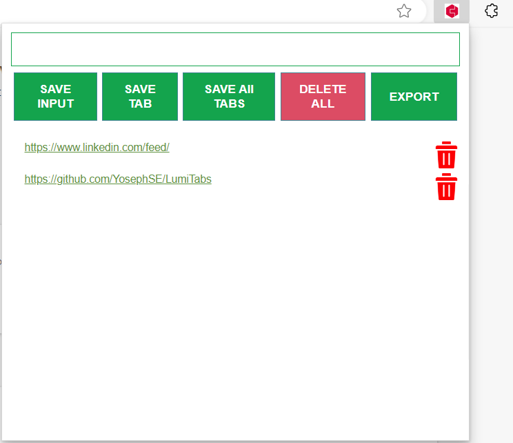

# LumiTabs - Chrome Extension

Welcome to **LumiTabs**! This extension is designed to help you manage and save your browser tabs, enhancing your productivity by keeping track of important links and sessions.

## Features

### Save Input
- **Save Custom Links**: Manually enter and save links using the input field. Perfect for keeping track of important URLs without having them open in a tab.

### Save Tabs
- **Save Current Tab**: Save the URL of your current active tab with a single click. 
- **Save All Tabs**: Capture all the URLs from your open tabs in the current window.

### Manage Tabs
- **Delete All Saved Links**: Clear all saved links from the local storage with one click.
- **Delete Individual Links**: Easily remove specific links from your saved list.

### Export
- **Export Links to CSV**: Export your saved links into a CSV file for easy sharing and backup.

## Installation

### From Source

1. Download the LumiTabs extension files.
2. Open Chrome and navigate to `chrome://extensions/`.
3. Enable "Developer mode" in the top right corner.
4. Click "Load unpacked" and select the LumiTabs directory.

### From Packed Version

1. Download the `LumiTabs.crx` file.
2. Open Chrome and navigate to `chrome://extensions/`.
3. Enable "Developer mode" in the top right corner.
4. Drag and drop the `LumiTabs.crx` file onto the Chrome extensions page to install.

## Usage

1. Click on the LumiTabs icon in the Chrome toolbar to open the popup.
2. Use the input field to manually add a URL and click "SAVE INPUT".
3. Click "SAVE TAB" to save the URL of your current active tab.
4. Click "SAVE ALL TABS" to save URLs of all open tabs in the current window.
5. To delete all saved links, click "DELETE ALL".
6. To export your saved links as a CSV file, click "EXPORT".

## Screenshot

## Development

### Prerequisites
- Chrome browser
- Basic knowledge of JavaScript, HTML, and CSS

### File Structure
- **manifest.json**: Configuration file for the Chrome extension.
- **index.html**: The popup interface of the extension.
- **main.js**: JavaScript file containing the logics.
- **assets/**: Directory containing CSS and image files.

## Contributing

Contributions are welcome! Please fork the repository and submit a pull request with your improvements.

## License

This project is licensed under the MIT License.

---

Feel free to reach out if you have any questions or need further assistance. Enjoy using LumiTabs to keep your browsing sessions organized and productive!

---

**LumiTabs** - Simplifying your browsing experience.

